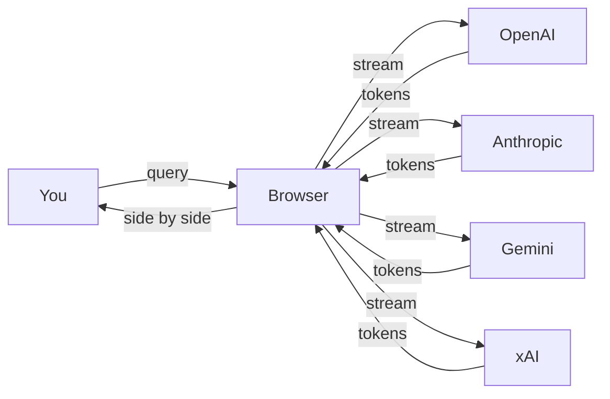
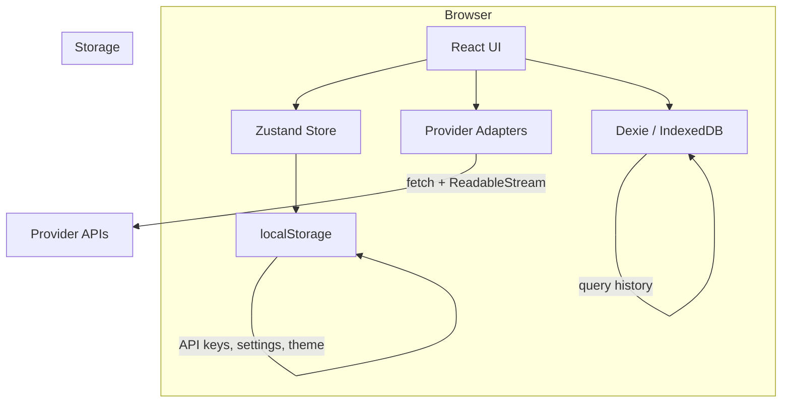
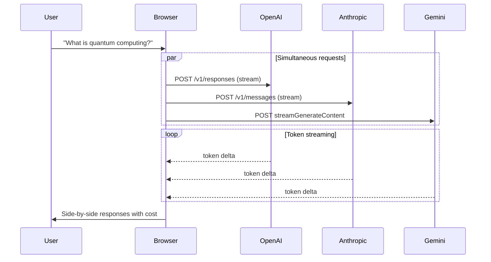
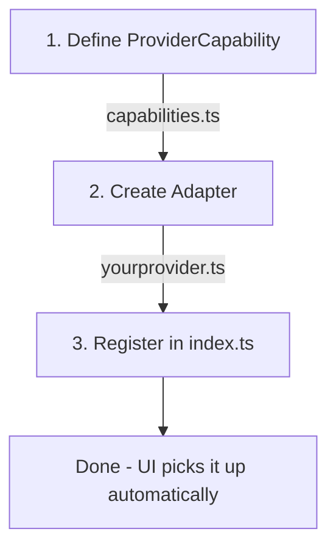

# Argeon

A personal AI multiplexer. Type one query, see responses from multiple AI models side by side.

Argeon is a pure client-side web app: no backend, no database, no user accounts. Your queries go directly from your browser to each AI provider. Your history stays in your browser.

## How It Works



All requests go directly from your browser to each provider. No backend, no proxy, no middleman.

## Architecture





## Supported Providers

- **OpenAI** (GPT-4o, GPT-4o-mini, etc.)
- **Anthropic** (Claude Sonnet, Claude Opus, etc.)
- **Google Gemini** (Gemini 2.5 Flash, Gemini 2.5 Pro, etc.)
- **xAI** (Grok 3, Grok 3 Mini, etc.)

## Local Development

```bash
npm install
npm run dev
```

Open `http://localhost:5173` in your browser.

## Deploy to Vercel (Static)

```bash
npm run build
```

The `dist/` directory contains a fully static site. Deploy it to Vercel, Netlify, or any static hosting.

For Vercel: push to a Git repo and import it. Vercel will auto-detect Vite and build correctly. No server functions needed.

## How to Add a New Provider



1. **Define capabilities** in `src/providers/capabilities.ts`:
   - Add a new entry to the `PROVIDERS` object with all required `ProviderCapability` fields
   - Set `apiStyle`, `supportsDirectBrowserCalls`, `browserKeyExposurePosture`, and feature flags accurately

2. **Create the adapter** in `src/providers/yourprovider.ts`:
   - Export `streamYourProvider(apiKey, model, query, files, callbacks, signal)` -- implements streaming via `fetch` + `ReadableStream`
   - Export `testYourProviderKey(apiKey)` -- minimal request to verify the key
   - Export `discoverYourProviderModels(apiKey)` -- fetch available models from the provider's API

3. **Register in the index** in `src/providers/index.ts`:
   - Import your three functions and add them to `streamFns`, `testFns`, and `discoverFns`

4. **That's it.** The UI automatically picks up new providers from the `PROVIDERS` object:
   - Setup page shows a new provider card
   - Main interface adds a new toggle chip and response column
   - Settings drawer shows model selection
   - Privacy page should be updated manually with the provider's retention note

## Privacy

Argeon has no server. See [PRIVACY.md](./PRIVACY.md) or the in-app `/privacy` page.

## Tech Stack

- Vite + React + TypeScript
- Tailwind CSS
- Zustand (state management)
- Dexie.js (IndexedDB for history)
- React Router v6
